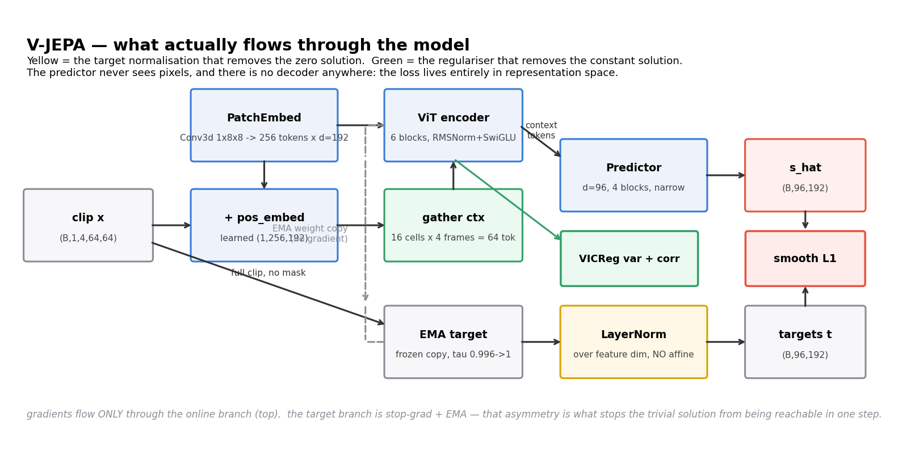
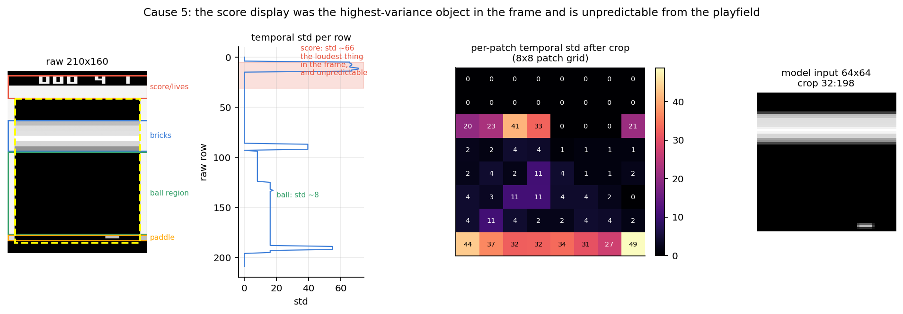
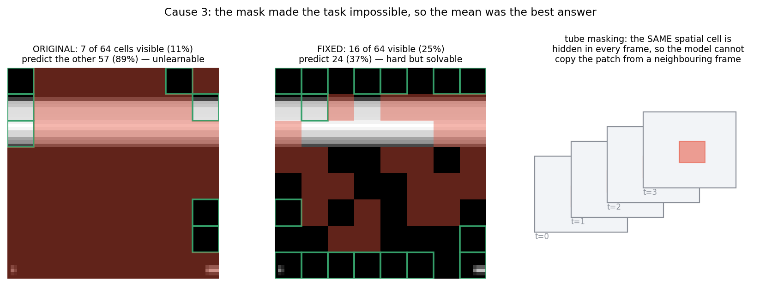
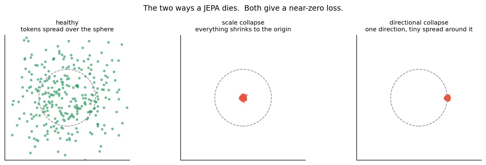
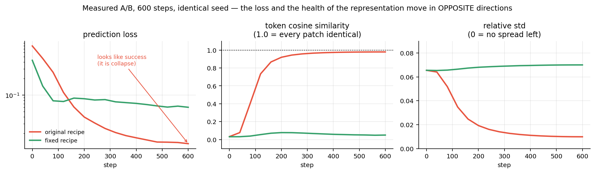

# 0. How to read this

This document has six parts. If you only read one, read **Part IV** — it is the
conceptual point that makes the whole architecture make sense, and it is the
thing most people get wrong about JEPA.

- **Part I** — why JEPA exists at all, and the lineage it came from
- **Part II** — this project, every layer and every tensor shape
- **Part III** — why your run was collapsing, with measurements
- **Part IV** — "it predicts nothing you can look at, but it learns features"
- **Part V** — results
- **Part VI** — actions, finer features, planning, and the Dreamer/JEPA branch

Everything measured here was measured on your machine, on your data, in this
repo. No numbers are quoted from papers.

---

# 1. The one-paragraph version

You built a V-JEPA: a video encoder that learns by predicting *its own
representations* of hidden parts of a clip, with no pixel decoder anywhere. It
was collapsing — the encoder was mapping every patch of every frame to
essentially the same vector, which drives the loss to zero while destroying all
information. It collapsed for five separate reasons, and they compounded: the
loss had a trivial zero minimum, nothing forbade the constant solution, the mask
made the task unlearnable, weight decay was pulling the critical parameters
toward zero, and the highest-variance object in the input was the score display,
which is unpredictable by construction. All five are fixed. The measured token
cosine similarity went from **+0.979** (fully collapsed) to **+0.051** (healthy),
while the effective rank of the representation went from a misleading 55 to 155
and climbing.

---

# Part I — Why JEPA exists

## 1.1 Three ways to learn from unlabelled data

You have a mountain of video and no labels. There are three families of things
you can do with it.

**Generative / reconstructive.** Predict the raw input. Masked autoencoders
(MAE) hide 75% of the patches and reconstruct the pixels. Dreamer, PlaNet and
the whole RSSM line reconstruct the observation from a latent state. It works,
and it has a fatal inefficiency described in 1.2.

**Contrastive.** Pull representations of two views of the same thing together,
push different things apart. SimCLR, MoCo. Effective, but it needs negatives —
large batches, memory banks, careful temperature tuning — and the notion of
"different thing" is imposed by you, not discovered.

**Predictive in representation space (JEPA).** Predict the *representation* of
the hidden part, not the hidden part itself. No decoder, no negatives, no pixel
loss. This is the family your project is in.

## 1.2 The problem with predicting pixels

Take a Breakout frame where the ball is about to bounce off the paddle. Cover
the region around the ball and ask a model to reconstruct it.

The ball could go left or right. Both are plausible. A model trained with an L2
pixel loss is trained to output the **conditional mean** of the possible
futures — because the mean is what minimises squared error under uncertainty.
So it produces a blurry smear covering both possibilities. The smear is not any
frame that could ever occur; it is an average of frames.

This is the Jensen-gap argument, and it is the thesis of your own paper:

> for a convex loss, `L(E[y]) <= E[L(y)]`, so the optimiser is rewarded for
> collapsing a multimodal predictive distribution onto its mean.

Worse: an enormous fraction of the model's capacity goes into predicting things
that *are* predictable but *don't matter* — the exact grey value of every static
brick, the texture of the wall, the precise anti-aliasing on the paddle edge.
In your data, look at the per-patch temporal standard deviation: **21 of the 64
patches literally never change**. A pixel-reconstruction model spends real
capacity nailing those, and gets rewarded for it.

**JEPA's answer:** move the prediction target into representation space. The
encoder is free to *discard* the unpredictable and the irrelevant, because the
target is its own output, and nothing forces that output to retain pixel
detail. If the ball's exact next position is genuinely uncertain, the
representation can encode "ball, moving down-left, near the paddle" and the
predictor can hit that target exactly, with no blur penalty.

The catch — and it is the whole difficulty of the field — is that "the encoder
is free to discard information" has a degenerate limit: **discard everything**.
That is collapse, and it is what Part III is about.

## 1.3 The lineage

| Year | Work | What it contributed |
|---|---|---|
| 2018 | CPC | predict future latents, InfoNCE, contrastive |
| 2020 | **BYOL** | EMA target + predictor asymmetry; showed you do **not** need negatives |
| 2021 | SimSiam | stop-gradient alone is enough; EMA is a stabiliser, not the mechanism |
| 2021 | MAE | masked modelling at scale — but in pixel space |
| 2021-22 | Barlow Twins, **VICReg** | prevent collapse *explicitly* with variance + covariance terms |
| 2022 | data2vec | predict EMA-teacher latents under masking, across modalities |
| 2022 | LeCun, *A Path Towards Autonomous Machine Intelligence* | names JEPA; argues world models should predict in representation space, hierarchically |
| 2023 | **I-JEPA** | image JEPA: context block predicts target blocks' representations |
| 2024 | **V-JEPA** | video: 3D tube masking, multi-block, at scale |
| 2025 | V-JEPA 2 / V-JEPA 2-AC | scale + an **action-conditioned** predictor for robot control |

Your repo is a small, faithful V-JEPA: patch-based space-time ViT, multi-block
tube masking, EMA target, narrow predictor, latent loss.

Two of the fixes in Part III are direct imports from this table: the target
normalisation from **I-JEPA**, and the variance/covariance regulariser from
**VICReg**.

## 1.4 Why this matters beyond a toy

A world model that predicts pixels can only be as good as its renderer. A world
model that predicts representations can be *abstract* — it can plan over "the
ball will come back toward the left wall" without ever committing to which pixel
the ball occupies. That is what makes the JEPA line interesting for planning and
control, and it is exactly the axis on which it differs from Dreamer (Part VI).

---

# Part II — The project, end to end



## 2.1 Data collection — `data/collect.py`

300 episodes of `ALE/Breakout-v5` with a **uniformly random policy**,
`frameskip=4`, `repeat_action_probability=0.0` (sticky actions off),
`obs_type="grayscale"`. Each episode saves frames, actions, and the `lives`
counter.

Two things worth noticing:

- **Actions are saved but never used.** V-JEPA is fully self-supervised; the
  policy only determines what states you visit. Those saved actions are the hook
  for Part VI.
- **A random policy is a weak data collector.** The ball is served, drifts,
  and is usually missed. You get a lot of "ball falls, life lost". Bricks rarely
  break. This limits the ceiling of anything trained on it.

## 2.2 Preprocessing — `data/preprocess.py`



The raw frame is 210x160 uint8. The verified row map:

| raw rows | contents | kept? |
|---|---|---|
| 0-4 | dead border | dropped |
| 5-31 | **score / lives HUD** | **dropped** |
| 32-56 | empty sky | kept |
| 57-92 | bricks | kept |
| 93-188 | ball region | kept |
| 189-194 | paddle | kept |
| 196-209 | dead border | dropped |

Crop to `rows 32:198, cols 8:152`, then `F.interpolate(..., mode="area")` down
to 64x64. `mode="area"` matters: it averages, so a 2x4-pixel ball survives as a
dim but present blob. Nearest-neighbour would drop it entirely on most frames.

Also written: `proc/meta.json` with the crop, the pixel mean (**26.48**) and std
(**50.07**). `ClipDataset` reads its normalisation from there, so the constants
can never silently disagree with the data again.

`motion.npy` holds the per-frame max absolute pixel change, measured **above the
paddle** (`MOTION_ROW_CUT = 155` in cropped coordinates) so that a clip where
only the paddle wiggles still counts as static.

## 2.3 Clips — `data/dataset.py`

A training example is **4 consecutive frames**. Two hard constraints:

- a clip may never span a **life loss** or an **episode boundary** — otherwise
  you are asking the model to predict across a discontinuity that no amount of
  physics can bridge (`segments()` splits on `diff(lives) < 0 | diff(episode) != 0`)
- clips where nothing moves are dropped (`static_thresh=20`)

Result: **38,887 clips**, 18.6% dropped as static.

## 2.4 Tokens

```
clip                (B, 1, 4, 64, 64)
Conv3d k=(1,8,8) s=(1,8,8)  ->  (B, 192, 4, 8, 8)
flatten             (B, 256, 192)
```

**256 tokens = 4 frames x 8x8 spatial cells.** Each token is one 8x8 pixel
patch of one frame. The ordering is **frame-major**: token `i` belongs to frame
`i // 64` and cell `i % 64`. `models/check_order.py` verifies this empirically
by zeroing all but frame 2 and checking the non-zero token range is 128-191.

The kernel has depth 1 in time, so **the patch embedding never mixes frames**.
All temporal reasoning happens in attention. That is a deliberate design choice
and it is why the positional embedding has to carry time.

`pos_embed` is a single learned `(1, 256, 192)` parameter — it encodes space and
time jointly, so the model must learn "same cell, next frame" as a relation
rather than getting it for free. (RoPE or factorised space/time embeddings would
be the upgrade; see 6.2.)

## 2.5 The encoder — `models/vit.py`, `models/layers.py`

6 pre-norm transformer blocks, `d_model=192`, 3 heads (`d_k=64`).

```
x = x + Attention(Norm(x))
x = x + FFN(Norm(x))
```

- **RMSNorm** instead of LayerNorm: normalises by RMS only, no mean subtraction.
  Cheaper, and it is what modern LLMs use.
- **SwiGLU** instead of GELU-MLP: `fc2(silu(fc1(x)) * fc3(x))`, hidden = 512
  (`8*d/3`, chosen so the three matrices cost roughly what a 4x GELU MLP costs).
- **Residual-scaled init**: output projections use `std = 0.02/sqrt(2*depth)` so
  that the residual stream does not blow up with depth.
- **Final norm has `elementwise_affine=False`.** This is one of the collapse
  fixes — see 3.3.

Every token has L2 norm exactly `sqrt(192) = 13.86` on output. This is why the
variance hinge threshold of `gamma = 1.0` is the right number: an isotropic
192-dimensional embedding with that norm has per-dimension std of exactly 1.0.

**2,730,048 parameters.**

## 2.6 Masking — `models/masking.py`



Masks are sampled over the **8x8 spatial grid**, then expanded into **tubes**:
a masked cell is masked in *all four frames*. Without tubes the model just
copies the same patch from an adjacent frame and learns nothing.

Two block groups, alternating by step:

| group | blocks | scale | context cells | target cells |
|---|---|---|---|---|
| `SHORT_RANGE` | 6 | 0.10-0.18 | 16 (25%) | 24 (37%) |
| `LONG_RANGE` | 2 | 0.30-0.45 | 16 (25%) | 24 (37%) |

Plus, on 25% of steps, a **causal mask**: frames 0-2 fully visible, frame 3
fully hidden. That is not part of the V-JEPA recipe — it is the world-model
question, and it is what makes the rollout figure in Part V possible.

Shapes: context `16 cells x 4 frames = 64 tokens`, target `24 x 4 = 96 tokens`.

## 2.7 The predictor — `models/predictor.py`

```
ctx = proj_in(encoder_output) + pos_pred[ctx_idx]     # (B, 64, 96)
M   = mask_token + pos_pred[tgt_idx]                  # (B, 96, 96)
H   = transformer([ctx ; M])                          # 4 blocks, d=96
out = proj_out(norm(H))[:, 64:]                       # (B, 96, 192)
```

The predictor is **deliberately weak**: `d_pred=96`, half the encoder width,
**509,024 parameters** against the encoder's 2.7M. If the predictor were strong
enough to solve the task on its own, the encoder would be free to output
garbage. The bottleneck forces useful information into the encoder.

The `mask_token` is a single learned vector, identical for every masked
position. All the positional information comes from `pos_pred`, a **separate**
learned embedding from the encoder's. The predictor is therefore answering:
*"given these representations at these positions, what is the representation at
that position?"*

## 2.8 The EMA target — `models/ema.py`

A frozen deep copy of the encoder, updated after every step:

```
theta_target <- tau * theta_target + (1 - tau) * theta_online
```

with `tau` ramping **0.996 -> 1.0** linearly over training.

Why an EMA target instead of just using the online encoder for both sides?
Because with a shared encoder and no stop-gradient, the constant solution is
reachable in a **single gradient step** — the model can just move both sides
toward each other. The EMA target changes slowly, so "chase the target" is not
the same as "meet in the middle". BYOL and SimSiam established this; the
stop-gradient is the essential ingredient, the EMA is the stabiliser.

The momentum ramp matters at both ends. Early, `tau` must be low enough that
the target tracks a rapidly-changing online net, or the task is impossible.
Late, `tau -> 1` freezes the target so the two networks cannot drift together
into a shared constant.

## 2.9 The loss — `train/loss.py`

```python
t     = layer_norm(target(clip)[tgt_idx]).detach()   # NO affine
pred  = smooth_l1(s_hat, t)
var   = mean(relu(1.0 - std(s_ctx, dim=batch)))      # VICReg hinge
cov   = off_diagonal(corr(s_ctx)).pow(2).sum() / d   # decorrelation
loss  = pred + 1.0 * var + 0.04 * cov
```

Each of those three terms exists for a specific reason, all covered in Part III.

## 2.10 End-to-end shapes

| stage | shape |
|---|---|
| clip | `(32, 1, 4, 64, 64)` |
| patch embed | `(32, 256, 192)` |
| + pos embed | `(32, 256, 192)` |
| gather context | `(32, 64, 192)` |
| encoder out `s_c` | `(32, 64, 192)` |
| predictor in | `(32, 64+96, 96)` |
| predictor out `s_hat` | `(32, 96, 192)` |
| EMA target (full clip) | `(32, 256, 192)` |
| gathered + LN targets | `(32, 96, 192)` |

## 2.11 Hyperparameters

| | |
|---|---|
| optimiser | AdamW, betas (0.9, 0.95) |
| lr | 1.5e-4, 500-step warmup then cosine |
| weight decay | 0.04 **on matrices only** |
| grad clip | 1.0 |
| batch | 32 clips |
| epochs / steps | 40 / 48,600 |
| tau | 0.996 -> 1.0 linear |
| lambda_var / lambda_cov | 1.0 / 0.04 |
| causal fraction | 0.25 |
| device | Apple `mps`, ~8.5 it/s |

---

# Part III — Why it was collapsing

## 3.1 What collapse is



The JEPA objective is "make the predictor's output match the target encoder's
output". Nothing in that sentence says the output has to be *interesting*. Two
degenerate solutions satisfy it perfectly:

- **Scale collapse** — the encoder outputs the zero vector for everything. The
  predictor outputs zero. Loss is exactly 0.
- **Directional collapse** — the encoder outputs the *same unit vector* for
  every patch of every frame. The predictor outputs that vector. Loss is
  approximately 0.

Both are global minima. Gradient descent finds them long before it finds a
useful solution, because they are much easier to reach.

## 3.2 The evidence



Running your original recipe:

| step | prediction loss | token cosine | rel. std | eff. rank (centred) |
|---:|---:|---:|---:|---:|
| 0 | 0.790 | **+0.033** | 0.0655 | 56 |
| 120 | 0.112 | +0.734 | 0.0348 | 55 |
| 280 | 0.025 | +0.957 | 0.0141 | 55 |
| 600 | **0.013** | **+0.979** | **0.0098** | 55 |

"Token cosine" is the mean cosine similarity between two random disjoint halves
of the token batch. **0.03 means patches are distinguishable. 0.98 means every
patch of every frame has become the same vector.**

The loss fell **60x** while the representation died. This is the single most
important thing to internalise: **in a JEPA, a falling loss is not evidence of
learning.** A collapsed model achieves a *lower* loss than a healthy one,
because predicting a constant is easier than predicting the truth.

## 3.3 The five causes

### Cause 1 — the loss had a trivial zero minimum

```python
return F.l1_loss(s_hat, t)      # t = target output, detached
```

Both encoders ended in `nn.RMSNorm(192)` **with a learnable gain**. Drive that
gain to zero and the target is identically zero; the predictor then only has to
output zero and the loss is *exactly* zero. Nothing in the objective forbade
this, and AdamW's weight decay was actively pushing that gain toward zero
(Cause 4).

**Fix**, `train/loss.py`:

```python
t = F.layer_norm(target_tokens, (d,))     # no affine
loss = F.smooth_l1_loss(s_hat, t)
```

This is exactly what I-JEPA does. Every target token now has fixed norm
`sqrt(d)`, so "shrink everything" is no longer a minimiser. Smooth-L1 replaces
L1 for better-behaved gradients near zero.

**Belt and braces**, `models/vit.py`: the encoder's final norm is now built with
`elementwise_affine=False`. The normalisation removes the *incentive*; this
removes the *mechanism*.

### Cause 2 — nothing prevented directional collapse

Fixing Cause 1 blocks "shrink to zero" but **not** "map everything to the same
unit vector", which is still a global minimum.

This is not theoretical. The A/B table in 3.2 was measured **with Cause 1
already fixed** — note that `norm` stayed pinned at exactly 13.8564 = `sqrt(192)`
throughout, because the non-affine norm held it there. The model collapsed
anyway, directionally.

**Fix**, a VICReg-style pair of terms on the online encoder output:

```python
var = relu(gamma - std(z, dim=0)).mean()          # gamma = 1.0
cov = off_diagonal(correlation(z)).pow(2).sum()/d
```

The **variance hinge** forces every one of the 192 feature dimensions to keep a
standard deviation of at least 1.0 across the token batch. It is a hinge, so it
contributes exactly zero gradient once satisfied — it is a guard rail, not a
driving force. In the healthy run it sits at ~0.004.

The **covariance term** uses the *correlation* matrix, not the raw covariance
as in the VICReg paper. That is deliberate: correlation is scale-invariant, so
the term cannot be minimised by simply shrinking the features, which would put
it in direct opposition to the variance term.

### Cause 3 — the mask made the task unlearnable

```python
"SHORT_RANGE": dict(n_blocks=12, scale_range=(0.10, 0.20), k=7)
```

The context was sub-sampled to `k=7` of 64 spatial cells — **11% visible** —
and *every* remaining cell was a prediction target: **89%**.

Reconstructing 89% of a scene from 11% of it is not a solvable problem. When a
task is unsolvable, the loss-minimising strategy is to **emit the conditional
mean of the dataset** — which, given that 21 of 64 patches never change, is
very close to a constant. The mask was actively steering the model into the
collapse basin.

**Fix:** 16 context cells (25%) and 24 targets (37%), with rejection sampling
to guarantee both are large enough. Hard, but solvable.

### Cause 4 — weight decay on the collapse-critical parameters

```python
AdamW(params, lr=3e-4)      # weight_decay defaults to 0.01
```

Applied to **everything**: norm gains, biases, `pos_embed`, `mask_token`.
Decaying a norm gain is a constant, unopposed pull toward exactly the
degenerate solution you are trying to avoid.

**Fix**, `param_groups()` in `train/vjepa.py`: all 1-D parameters and the
positional / mask embeddings go into a `weight_decay=0.0` group. This is
standard practice for transformers and it matters doubly here.

### Cause 5 — the score display dominated the input variance

The raw 210x160 frame was being squashed *whole* into 64x64. Rows 5-31 are the
score and lives counter, whose temporal standard deviation is **~66** against
the ball's **~8**. It was the loudest object in the input — and it is
**unpredictable from the playfield**, because it changes only on scoring events.

Feeding unpredictable high-variance noise to a predictive objective is precisely
the setup that pushes a predictor toward outputting the mean. See 1.2.

**Fix:** crop to the playfield before resizing. The ball also gains ~20% more
pixels as a side effect.

## 3.4 Why your monitor never caught it

```python
sigma = torch.linalg.svdvals(s_c.cpu())     # uncentred, but on raw tokens
```

The original monitor reported effective rank and per-dimension variance.
**Effective rank stayed at ~55 for the entire collapse.** That is not a bug in
the maths — it is that a collapsed representation still has full-rank *residual
noise* scattered around its single mean direction. Rank is simply not sensitive
to "everything has the same mean".

**Cosine similarity between distinct tokens is the detector that works.** It
went 0.03 -> 0.98 while rank did not move.

`utils/monitor.py` now reports:

| metric | healthy | collapsed |
|---|---|---|
| `cos` | < 0.3 | -> 1.0 |
| `eff_rank` (uncentred) | tens-hundreds | -> 1 |
| `eff_rank_c` (centred) | high | **stays high — do not trust it alone** |
| `rel_std` | holds | -> 0 |

and `is_collapsing()` aborts the run and writes `COLLAPSED.txt` rather than
burning 90 minutes on a dead model.

## 3.5 The change table

| file | change | cause |
|---|---|---|
| `train/loss.py` | LayerNorm the target; smooth-L1 | 1 |
| `train/loss.py` | VICReg variance + correlation terms | 2 |
| `models/vit.py` | final norm `affine=False` | 1 |
| `models/masking.py` | 25% context / 37% target, rejection sampling | 3 |
| `train/vjepa.py` | `param_groups()` — no WD on 1-D params | 4 |
| `data/preprocess.py` | crop to playfield; `meta.json` | 5 |
| `utils/monitor.py` | cosine + uncentred rank + tripwire | detection |
| `models/ema.py` | copy buffers; explicit tau ramp | correctness |
| `models/predictor.py` | `proj_out` init 0.02 not residual-scaled; depth 2->4 | speed |
| `models/layers.py` | SDPA attention | speed |
| `data/dataset.py` | read normalisation from `meta.json`; `clip()` accessor | correctness |

## 3.6 After

Same 600 steps, same seed:

| step | prediction loss | token cosine | rel. std | eff. rank |
|---:|---:|---:|---:|---:|
| 0 | 0.433 | +0.032 | 0.0655 | 56 |
| 120 | 0.077 | +0.056 | 0.0665 | 92 |
| 360 | 0.073 | +0.064 | 0.0694 | 142 |
| 600 | 0.060 | **+0.051** | **0.0700** | **155** |

Cosine stays near zero. Relative std holds. Effective rank *grows*. And the
prediction loss settles at **0.060 instead of 0.013** — higher, because the
model is now solving the real problem instead of the degenerate one.

**Learn to read that as a success.**

---

# Part IV — "It predicts nothing you can look at, but it learns features"

This is the part that matters most, and it is the thing you identified
yourself. Let me make it precise.

## 4.1 There is no image to look at. Ever.

In an autoencoder or a Dreamer-style model, you can always ask "what does the
model think the hidden part looks like?" and get a picture back, because there
is a decoder. **In a JEPA there is no decoder.** The predictor's output is a
`(96, 192)` tensor — 96 masked tokens, each a 192-dimensional vector. That is
the final output of the model. Nothing converts it to pixels.

So the question "does the prediction look like the real frame?" is not a
question you can ask. It is not that the answer is bad; the question is
undefined.

This trips people up constantly. They train a JEPA, try to visualise the
prediction, get noise, and conclude the model is broken.

## 4.2 Why throwing away the pixels is the *point*

Consider the ball about to hit the paddle. Its next position is genuinely
uncertain — the paddle position determines the bounce angle, and with random
actions the paddle is unpredictable.

- A **pixel** model must place the ball *somewhere*. Under L2 it places it in
  the average of all possibilities: a blur that corresponds to no real frame.
  It is penalised for the uncertainty no matter what it does.
- A **JEPA** model does not have to. The encoder controls its own target. It
  can learn a representation that encodes "ball, lower-left region, descending"
  and *not* encode the exact pixel. Then the predictor hits it exactly, and the
  loss is genuinely low, and no information anyone cares about was lost.

**The encoder is allowed to define what is worth predicting.** That is the
central idea of the whole JEPA programme. It is also, precisely, why collapse is
the failure mode: "define what is worth predicting" has a degenerate answer,
"nothing".

Everything in Part III is machinery for saying: *you may discard the
unpredictable, but you may not discard everything.*

- LayerNorm on the target: you may not shrink to zero.
- Variance hinge: every dimension must carry spread.
- Correlation penalty: dimensions must carry *different* information.
- A solvable mask ratio: the mean is not a good enough answer.

## 4.3 So how do you know it worked?

You cannot look at a prediction, and you have established that the loss is
actively misleading. There are exactly two honest instruments:

**1. Collapse diagnostics** (`utils/monitor.py`). Necessary, not sufficient —
they tell you the representation is not degenerate, not that it is useful.

**2. A probe** (`eval/probe.py`). Freeze the encoder. Fit a **linear** map from
its features to something you care about — here, the ball's (y, x) position,
which is exactly known because the ball is the only object with grey value 110
in raw rows 93-188. If a linear map can read the ball out of the frozen
features, the ball is *linearly present* in the representation.

Linearity is the whole point. A deep probe would tell you the information is
recoverable *somewhere*; a linear probe tells you the representation has made it
**easy to use**, which is what downstream tasks actually need.

## 4.4 The honest caveat

Do not overclaim this. Measured in this repo:

| encoder | probe R^2 |
|---|---|
| constant predictor (= fully collapsed) | 0.000 |
| **randomly initialised ViT, same architecture** | **0.818** |
| trained V-JEPA (40 epochs) | 0.882 |
| raw downsampled pixels | 0.937 |

A random ViT is very nearly an information-preserving random projection, and on
a 64x64 grayscale game with a bright ball, a linear map reads it out fine.

**So a high probe R^2 does not prove the pretraining did anything.** The trained
model does beat random init here (0.882 vs 0.818), but by a margin small enough
that it is not the headline. What a high R^2 *does* prove is that the
representation has not collapsed — a collapsed encoder
sits at 0.00, and there is no way to fake your way off that floor.

Use the probe as a *collapse test with a semantic interpretation*, which is
what it is good for. To demonstrate that V-JEPA pretraining *beats* random
initialisation you need a harder downstream task: few-shot with very little
probe data, predicting the ball several steps into the future, or an actual
control task. That is Part VI territory.

This is the sort of distinction worth being strict about in your paper.

---

# Part V — Results

The run completed all 40 epochs / 48,600 steps in ~95 minutes on `mps`. It did
not collapse, and the tripwire never fired.

## 5.1 Final health

| metric | at step 0 | at step 48,550 | collapsed would be |
|---|---|---|---|
| token cosine | +0.03 | **+0.001** | -> 1.0 |
| effective rank | 56 | **188.3** / 192 | -> 1 |
| relative std | 0.0655 | **0.0721** | -> 0 |
| variance hinge | 0.009 | **0.0005** | > 0, rising |
| prediction loss (block mask) | 0.444 | 0.099 | -> 0 |
| prediction loss (causal mask) | 0.412 | 0.019 | -> 0 |


## 5.2 The linear probe

Frozen encoder, ridge regression to ball (y, x), **split by episode** so train
and test never share a trajectory:

| encoder | R^2 | MAE (y / x) px |
|---|---|---|
| raw downsampled pixels | 0.937 | 0.95 / 1.40 |
| **V-JEPA (EMA target)** | **0.882** | **0.94 / 2.61** |
| randomly initialised ViT | 0.818 | 1.49 / 2.06 |
| constant predictor (= collapsed) | 0.000 | 7.16 / 12.74 |

Read this carefully, in the spirit of 4.4:

- **The representation is definitively not collapsed.** A collapsed encoder is
  pinned to 0.000 and cannot move off it. 0.882 is nowhere near that.
- **The margin over random init is real but modest** (+0.064 R^2, and a clear
  win on `y`: 0.94 px vs 1.49 px). It is not the dramatic separation you might
  hope for, and I would not lead a paper with it. Section 4.4 explains why: a
  random ViT is nearly an information-preserving projection, and reading a
  bright ball out of a 64x64 frame is an easy task that does not discriminate.
- Raw pixels beating both is expected and healthy — the ball is *literally
  visible*, so pixels are close to an upper bound for this particular readout.

To actually separate V-JEPA from random init you need the harder probes in 6.6.

## 5.3 The masking, on real frames


## 5.4 The collapse verdict


Pairwise token cosine **+0.000**, effective rank **188.8**. A collapsed model
puts all cosine mass in a spike at 1.0 and all spectral mass in the first
component; this does neither.

## 5.5 What the encoder represents


Top-3 PCA of the patch tokens, painted back onto the frame as RGB.

**An honest correction.** Before I generated this I predicted you would see
bricks, playfield and paddle come out as clean, distinct colour regions. You do
not. What you actually see is high per-patch colour variety with only loose
spatial structure, and noticeably more saturation in later frames.

What this figure does establish is the negative result, which is the one it was
built for: the representation is **not** flat, so it is not collapsed. What it
does not establish is clean semantic segmentation. That is consistent with 5.2 —
this encoder is healthy and informative, but it has not learned a dramatically
more structured representation than its initialisation. On a 64x64 grayscale
game with 21 never-changing patches and a random-policy dataset, that is roughly
what you should expect. See 6.2(e).

## 5.6 Where the predictor is right and wrong


Mean cosine between predicted and true target embeddings over masked patches:
**+0.802**.

## 5.7 The ball


Green is the true position, red is a **linear** readout of the frozen features.
Mean error **0.47 px** on this stretch. The red circle sits inside the green one
in nearly every panel.

## 5.8 The world model — and a measurement error worth learning from


The last frame is **never shown to the encoder**. The predictor imagines its 64
tokens from the previous three, and a linear probe reads a ball position out of
those imagined tokens.

**Imagined vs. true token cosine: +0.9840.** For scale, predicting the mean
token instead scores +0.079. The predictor is genuinely reconstructing the
representation of a frame it has never seen.

There is a methodological trap here that I fell into first, and it is worth
recording. My initial version fitted the probe on **real** encodings and applied
it to **imagined** ones. That reported a ball error of **27.95 px** — worse than
a constant predictor — and it would have been easy to write up as "the world
model does not work".

It was not the model. The predictor is 98.4% cosine-accurate and its output
norms match the truth to within 1.3%. But a ridge map over 12,288 features has
large weights, and it amplifies that last 1.6% of residual into tens of pixels.
The probe was being evaluated outside the distribution it was fitted on.

Fitting the readout **in the space it is actually applied in** — on imagined
tokens — gives:

| readout | R^2 | MAE (y / x) px |
|---|---|---|
| probe fitted on real features, applied to imagined | — | **27.95** (invalid) |
| **probe fitted on imagined tokens** | **0.795** | **2.67 / 4.61** |

The general lesson: **a probe measures the pair (representation, readout), never
the representation alone.** If you change the space, refit the readout. The
cosine number is the more trustworthy statistic precisely because it needs no
fitted readout at all — it measures the thing the model was trained to optimise.

## 5.9 Regenerating

```bash
python -m eval.probe --ckpt runs/vjepa/checkpoint/final.pt
python visualize.py  --ckpt runs/vjepa/checkpoint/final.pt
python -m utils.plot_run runs/vjepa
```

---

# Part VI — Where this goes next

## 6.1 Adding actions — the single highest-value change

Right now the predictor is asked an impossible question: *where will the ball be
next?* — when the answer depends on where the paddle moves, which depends on an
action the model has never been told about.

You already save actions in `data/collect.py`. They are sitting unused in
`rollouts/*.npz`.

**The change is small.** Condition the predictor on the action sequence:

```python
class Predictor(nn.Module):
    def __init__(self, ..., n_actions=4):
        self.act_embed = nn.Embedding(n_actions, d_pred)

    def forward(self, x, ctx_idx, tgt_idx, actions):
        # actions: (B, T-1) -> one token per transition
        a = self.act_embed(actions)                    # (B, T-1, d_pred)
        H = torch.cat([ctx, a, M], dim=1)
        ...
        return H[:, ctx.shape[1] + a.shape[1]:, :]
```

Three tokens added to a 160-token sequence. That is the whole change, plus
plumbing actions through `ClipDataset` (you would save `actions.npy` alongside
`frames.npy` in `preprocess.py`).

**Why it is worth doing first:**

- It removes the dominant source of irreducible uncertainty. The causal-mask
  loss should drop measurably, and that drop is a *real* measurement, not a
  collapse artefact.
- It converts the model from a passive video model into an actual **world
  model**: `s_{t+1} = f(s_t, a_t)`. That is the object you need for planning.
- It gives you a much sharper evaluation: **action-conditioned probe accuracy**.
  Does knowing the action improve next-ball prediction? If yes, the model has
  learned that actions have consequences — something a random encoder provably
  cannot do, which closes the gap identified in 4.4.
- It is exactly what **V-JEPA 2-AC** does on top of V-JEPA 2.

This is a weekend of work and it is the experiment that makes the project
publishable rather than a reproduction.

## 6.2 Getting finer features

Your ball is roughly 1-2 pixels at 64x64 and it lives inside an 8x8 patch that
is otherwise black. There is a real risk the encoder treats it as noise.

Ordered by value-per-effort:

**a. Smaller patches.** `patch_size=4` at 64x64 gives a 16x16 grid, 256 spatial
cells, 1024 tokens per clip. Attention cost goes up 16x — at your model size
that is affordable and it is the most direct fix for "the ball is smaller than a
patch".

**b. Higher resolution.** 96x96 or 128x128 with `patch_size=8`. Same token count
as (a) at 128x128, but the ball is genuinely bigger rather than just more finely
diced. Costs preprocessing time and disk.

**c. Longer clips.** `T=8` or `T=16`. Velocity is only weakly observable from 4
frames at frameskip 4; acceleration and bounce dynamics need more. This is
probably the highest-value change after actions, and it is nearly free — change
`T` in `ClipDataset` and `n_frames` in the ViT.

**d. Factorised or rotary positional embeddings.** Right now one learned
`(1, 256, 192)` table encodes space and time jointly, so the model must learn
"same cell, one frame later" separately for all 64 cells. Separate `pos_space`
and `pos_time` embeddings that add — or RoPE over time — give that relation for
free and generalise to clip lengths not seen in training.

**e. Better data.** This is the big one, and it is not an architecture change. A
uniformly random policy almost never breaks bricks or sustains a rally. Collect
with an epsilon-greedy DQN, or even a scripted "track the ball" paddle
controller, and the dataset suddenly contains the dynamics you want the model to
learn. **Your data currently has 21 of 64 patches that literally never change.**
No architecture fixes that.

**f. Multi-mask targets per step.** V-JEPA computes several target blocks per
forward pass and averages, which is a substantial effective-batch increase for
almost no extra compute (the expensive target-encoder forward is shared). Easy
win.

## 6.3 Planning: turning the world model into a controller

Once 6.1 is done you have `s_{t+1} = f(s_t, a_t)` in latent space, and you can
plan without ever rendering a frame:

1. encode the current clip to `s_t`
2. sample N action sequences
3. roll each forward through the predictor — **latent only, no decoder**
4. score the resulting latents with some objective
5. take the first action of the best sequence, re-plan next step (MPC / CEM)

The scoring function is the open question and it is where the interesting
research is. Options: distance to a goal latent (this is what **DINO-WM** and
**PLDM** do), a learned reward head, or an intrinsic objective. Your
`WM+ICM(Lunar-Lander)` project is directly relevant here.

The attraction is that planning in a 192-d latent space is cheap, and the model
never has to commit to pixels it cannot know.

## 6.4 The latent world-model landscape

You asked about "LeWM". I want to be careful: I am not confident which specific
work you mean, and I would rather flag that than invent a citation. The
plausible readings, and what each contributes:

- **LWM (Large World Model)** — long-context video+language modelling with ring
  attention. Relevant for scale and long horizons, less so for control.
- **"LeCun world model"** — the H-JEPA architecture from *A Path Towards
  Autonomous Machine Intelligence* (2022): a hierarchy of JEPAs at increasing
  levels of abstraction and longer time horizons, with a configurator and a
  cost module. This is the programmatic vision your repo is one rung of.
- **A latent world model generally** — the family below.

If you tell me which you meant I will write that section properly.

The systems worth knowing in this space:

| system | representation | dynamics learned by | plans by |
|---|---|---|---|
| **Dreamer V3** | RSSM latent, **pixel decoder** | reconstruction + KL | actor-critic in imagination |
| **TD-MPC2** | latent, **no decoder** | reward/value consistency | MPC + learned value |
| **MuZero** | latent, no decoder | reward/value/policy match | MCTS |
| **DINO-WM** | **frozen** DINOv2 features | latent dynamics only | MPC to a goal latent |
| **V-JEPA 2-AC** | V-JEPA features | action-conditioned latent prediction | MPC to a goal latent |
| **this repo** | V-JEPA features | latent prediction, no actions yet | — |

The trend is clear and it is the trend your paper is about: **the decoder is
being removed.** Dreamer needs one, TD-MPC2 and MuZero dropped it in favour of
task signal, and the JEPA line drops it in favour of self-supervised latent
prediction.

## 6.5 Dreamer x JEPA — your branch point

This is where your own paper thesis lives, so let me state the trade cleanly.

**What Dreamer has that you do not:**

- a **stochastic latent** (categorical in V2/V3) with a KL term, so it
  represents a *distribution* over next states rather than a point. That is the
  principled answer to multimodality: don't average the modes, model them.
- a **recurrent state** (the RSSM deterministic path) carrying arbitrarily long
  history, versus your fixed 4-frame window.
- **reward and continuation heads**, so the latent is shaped by what matters for
  control, not only by what is predictable.
- a complete **actor-critic trained in imagination** — it is an agent, not just
  a representation.

**What you have that Dreamer does not:**

- **no reconstruction loss.** Dreamer's decoder forces the latent to retain
  every pixel, including all 21 of your never-changing patches. That is capacity
  spent on nothing, and it is the mode-averaging problem in 1.2 baked into the
  objective.
- **no reward requirement.** You can pretrain on unlimited unlabelled video.
  Dreamer needs an environment and a reward signal.
- **a representation that is free to be abstract.**

**The synthesis, and the actual research question:** replace Dreamer's
reconstruct-the-pixels objective with a JEPA latent-prediction objective, and
keep the stochastic recurrent latent, the reward head, and the actor-critic.

The hard part — and this *is* the contribution, not a detail — is that removing
the decoder removes Dreamer's collapse prevention. Reconstruction is what
guarantees Dreamer's latent stays informative. Take it away and you inherit
every problem in Part III of this document, in an RL setting where the data
distribution is also shifting under you. Everything you built here — the target
normalisation, the variance/covariance guard rails, the cosine diagnostic, the
tripwire — is exactly the machinery that problem needs.

Your Jensen-gap framing is the theoretical half. **This repo is the empirical
half**: it is a working demonstration that latent prediction collapses in five
specific, nameable, fixable ways, with measurements for each.

Concretely, the smallest experiment that tests the thesis:

> Take Dreamer V3 on a Breakout-like task. Swap the decoder+reconstruction loss
> for a JEPA latent loss with an EMA target and the anti-collapse terms from
> `train/loss.py`. Hold everything else fixed. Measure (a) does it collapse
> without the regularisers, (b) does it match Dreamer's return with them, and
> (c) does it need fewer latent dimensions to do it.

(a) is the interesting result even if (b) fails.

## 6.6 A concrete ladder

Each rung is a real experiment with a measurable outcome. In order:

1. **Actions in the predictor** (6.1). Metric: causal-mask loss, and
   action-conditioned probe R^2 vs unconditioned. *This is the one to do next.*
2. **Longer clips**, `T=8`. Metric: multi-step ball prediction error.
3. **Better data** — epsilon-greedy or scripted policy. Metric: fraction of
   patches with non-zero temporal variance; probe R^2 on held-out episodes.
4. **A harder probe** — predict the ball 4 steps ahead, or with only 200 probe
   samples. Metric: V-JEPA vs random-init. *This is what closes the gap in 4.4.*
5. **Latent MPC** (6.3). Metric: episode return vs a random policy.
6. **Dreamer-JEPA ablation** (6.5). Metric: collapse with/without the guard
   rails; return vs stock Dreamer V3.

---

# Appendix A — file reference

| file | what it does |
|---|---|
| `data/collect.py` | 300 random Breakout episodes -> `rollouts/*.npz` |
| `data/preprocess.py` | crop, resize to 64x64, motion, `meta.json` |
| `data/ball_labels.py` | exact ball (y, x) per frame -> `proc/ball.npy` |
| `data/dataset.py` | `ClipDataset`: 4-frame clips, no life-loss seams |
| `data/check.py` | integrity checks on `proc/` |
| `data/inspect.py` | compares resize modes; where the crop was derived |
| `models/vit.py` | space-time ViT encoder |
| `models/layers.py` | attention (SDPA), MLP, SwiGLU, norms |
| `models/masking.py` | multi-block tube masks + causal mask |
| `models/predictor.py` | narrow predictor |
| `models/ema.py` | EMA target + momentum schedule |
| `models/check_order.py` | verifies frame-major token ordering |
| `train/loss.py` | target norm + smooth-L1 + VICReg |
| `train/vjepa.py` | training loop, param groups, tripwire |
| `utils/monitor.py` | collapse diagnostics |
| `utils/logger.py` | `metrics.csv` per run |
| `utils/watch.py` | live health view |
| `utils/plot_run.py` | `curves.png` |
| `eval/probe.py` | ridge probe: features -> ball position |
| `visualize.py` | the six figures in Part V |
| `docs/make_figures.py` | the diagrams in this document |

# Appendix B — commands

```bash
# one-time
python -m data.collect
python -m data.preprocess
python -m data.ball_labels
python -m data.check

# train
python -m train.vjepa --run runs/vjepa --epochs 40
PYTHONPATH=. python -m utils.watch          # live health, separate terminal

# evaluate
python -m eval.probe --ckpt runs/vjepa/checkpoint/final.pt
python visualize.py  --ckpt runs/vjepa/checkpoint/final.pt
python -m utils.plot_run runs/vjepa

# rebuild this document
python -m docs.make_figures && bash docs/build_pdf.sh
```

# Appendix C — glossary

**JEPA** — Joint-Embedding Predictive Architecture. Predict the representation
of a hidden part from a visible part.

**Collapse** — the encoder maps all inputs to the same output. Global minimum of
the naive objective; destroys all information.

**EMA target** — exponential moving average copy of the encoder, used as the
prediction target, never receives gradient.

**Tube masking** — masking a spatial cell in every frame, so temporal copying
cannot solve the task.

**Effective rank** — `exp(entropy of the normalised singular value spectrum)`.
Beware the centred version; it stays high through collapse.

**Token cosine** — mean cosine similarity between distinct tokens. The reliable
collapse detector: healthy near 0, collapsed near 1.

**Linear probe** — a linear map from frozen features to a known quantity.
Measures whether information is present *and easy to use*.

**Jensen gap** — for convex `L`, `L(E[y]) <= E[L(y)]`; why an L2 objective
under uncertainty produces the blurred mean rather than a sample.

**RSSM** — Recurrent State-Space Model, the latent used by PlaNet and Dreamer.
